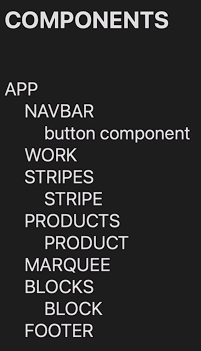
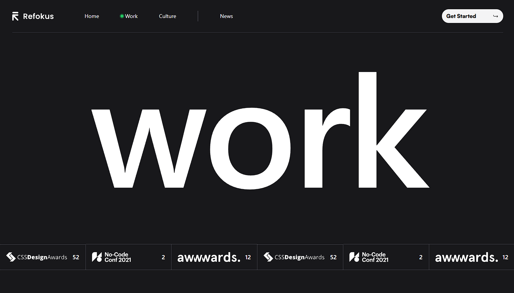
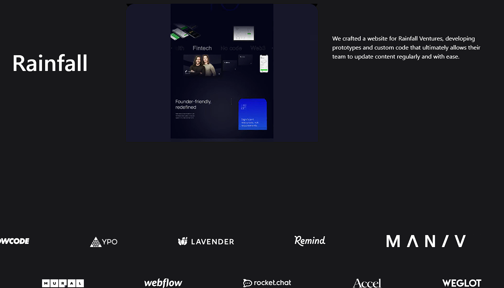
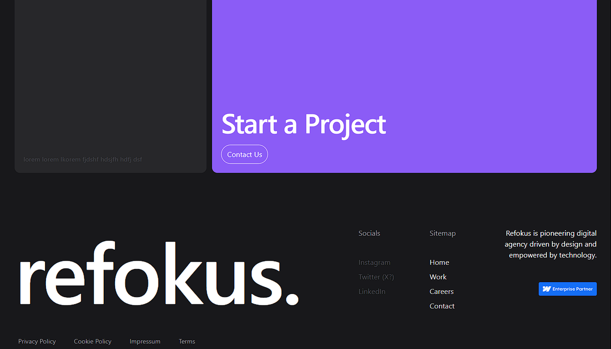

# Refokus Clone 🎨

## 🚀 Project Overview
Refokus Clone is a dynamic web application built with modern React technologies. This project showcases my expertise in building interactive, animated UI components and leveraging advanced libraries for enhanced user experiences.

## 🛠️ Technologies Used
- **React** for building the core application structure
- **Locomotive Scroll** for smooth scrolling animations
- **Framer Motion** for rich and customizable animations
- **React Icons** for seamless integration of scalable icons

## 🌟 Skills Acquired
- Implementing advanced scroll-triggered animations with Locomotive Scroll
- Creating fluid animations and transitions using Framer Motion
- Building responsive and user-friendly interfaces with React
- Integrating icon libraries for enhanced UI design

## 💻 App Layout

## 📸 Screenshot

## 🎯 Key Features
- Interactive scroll animations
- Smooth page transitions
- Customizable button components
- Dynamic content loading and UI responsiveness

## 🚧 Challenges Faced
- Ensuring cross-browser compatibility for smooth animations
- Integrating external libraries to work seamlessly with React state management

## 💡 Future Enhancements
- Adding more interactive features like modals and popups
- Extending accessibility features for better usability

## 🔗 Demo 
- **Live Demo**: [link-to-live-demo]

---

Feel free to connect with me to learn more about this project or discuss potential collaborations! 😊
